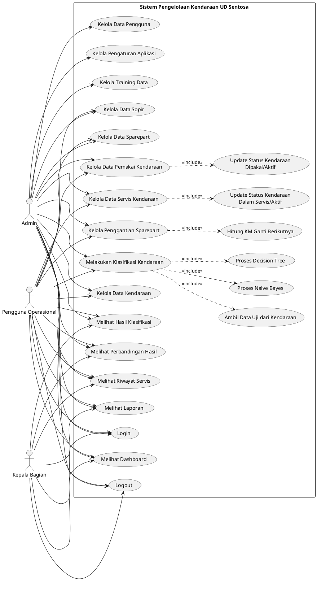

# Use Case Diagram Sistem Pengelolaan Kendaraan UD Sentosa

## Aktor

- **Admin**: pengguna dengan akses penuh ke seluruh sistem.
- **Pengguna Operasional**: petugas yang mengelola data operasional kendaraan.
- **Kepala Bagian**: pimpinan yang memantau dashboard, hasil klasifikasi, riwayat, dan laporan.

## Diagram Mermaid

```mermaid
flowchart LR
    Admin([Admin])
    Operasional([Pengguna Operasional])
    Kepala([Kepala Bagian])

    subgraph Sistem["Sistem Pengelolaan Kendaraan UD Sentosa"]
        Login((Login))
        Dashboard((Melihat Dashboard))
        Logout((Logout))

        KelolaUser((Kelola Data Pengguna))
        Pengaturan((Kelola Pengaturan Aplikasi))
        Training((Kelola Training Data))

        Kendaraan((Kelola Data Kendaraan))
        Sopir((Kelola Data Sopir))
        Sparepart((Kelola Data Sparepart))
        Pemakai((Kelola Data Pemakai Kendaraan))
        Servis((Kelola Data Servis Kendaraan))
        Penggantian((Kelola Penggantian Sparepart))

        Riwayat((Melihat Riwayat Servis))
        Klasifikasi((Melakukan Klasifikasi Kendaraan))
        HasilKlasifikasi((Melihat Hasil Klasifikasi))
        Perbandingan((Melihat Perbandingan Hasil))
        Laporan((Melihat Laporan))

        UpdateStatusPemakai((Update Status Kendaraan Dipakai/Aktif))
        UpdateStatusServis((Update Status Kendaraan Dalam Servis/Aktif))
        HitungKmBerikutnya((Hitung KM Ganti Berikutnya))
        AmbilDataKendaraan((Ambil Data Uji dari Kendaraan))
        NaiveBayes((Proses Naive Bayes))
        DecisionTree((Proses Decision Tree))
    end

    Admin --> Login
    Operasional --> Login
    Kepala --> Login

    Admin --> Dashboard
    Operasional --> Dashboard
    Kepala --> Dashboard

    Admin --> KelolaUser
    Admin --> Pengaturan
    Admin --> Training

    Admin --> Kendaraan
    Admin --> Sopir
    Admin --> Sparepart
    Admin --> Pemakai
    Admin --> Servis
    Admin --> Penggantian
    Admin --> Klasifikasi

    Operasional --> Kendaraan
    Operasional --> Sopir
    Operasional --> Sparepart
    Operasional --> Pemakai
    Operasional --> Servis
    Operasional --> Penggantian
    Operasional --> Klasifikasi

    Admin --> Riwayat
    Operasional --> Riwayat
    Kepala --> Riwayat

    Admin --> HasilKlasifikasi
    Operasional --> HasilKlasifikasi
    Kepala --> HasilKlasifikasi

    Admin --> Perbandingan
    Operasional --> Perbandingan
    Kepala --> Perbandingan

    Admin --> Laporan
    Operasional --> Laporan
    Kepala --> Laporan

    Admin --> Logout
    Operasional --> Logout
    Kepala --> Logout

    Pemakai -. include .-> UpdateStatusPemakai
    Servis -. include .-> UpdateStatusServis
    Penggantian -. include .-> HitungKmBerikutnya
    Klasifikasi -. include .-> AmbilDataKendaraan
    Klasifikasi -. include .-> NaiveBayes
    Klasifikasi -. include .-> DecisionTree
```

## Diagram PlantUML

## Ringkasan Hak Akses

| Aktor | Hak Akses |
| --- | --- |
| Admin | Mengakses seluruh fitur sistem |
| Pengguna Operasional | Mengelola data kendaraan, sopir, sparepart, pemakai, servis, penggantian sparepart, dan melakukan klasifikasi |
| Kepala Bagian | Melihat dashboard, riwayat servis, hasil klasifikasi, perbandingan hasil, dan laporan |
